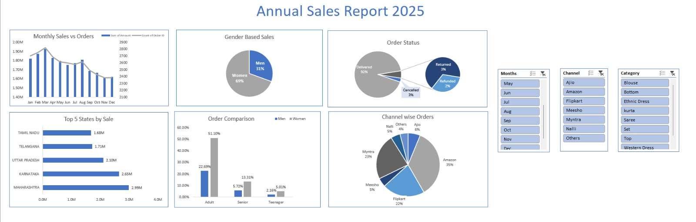

# Vrinda Store Annual Sales Analysis (2022)

An end-to-end data analytics project using **Microsoft Excel** to analyze annual retail sales data, uncover customer demographics, and build an interactive dashboard to drive strategic business growth.

## 📊 The Interactive Dashboard

---

## 🎯 Business Objective
Vrinda Store, an online clothing retailer operating across India, wanted to analyze its performance data from 2022 to understand consumer behavior and execution flaws. The primary goal was to deliver data-driven strategies to scale revenue and optimize marketing channels for the upcoming fiscal year (2023).

## 🛠️ Data Analytics Lifecycle Followed

### 1. Data Cleaning & Preparation
* **Data Auditing:** Inspected over 30,000+ rows of raw transactional records for missing values, structural formatting, and outliers.
* **String Standardization:** Handled text inconsistencies in the `Gender` field using advanced `Find & Replace` logic to unify entries (e.g., mapping `M` to `Men` and `W` to `Women`).
* **Data Hygiene:** Rectified formatting in the `Quantity` column to ensure numerical uniformity for calculation accuracy.

### 2. Feature Engineering (Data Processing)
* **Demographic Bucketing:** Created a dynamic `Age Group` attribute utilizing nested `IF` logic to partition buyers into logical groups: *Senior* (>=50), *Adult* (30-49), and *Teenager* (<30).
* **Temporal Extraction:** Isolated the `Month` metric from raw timestamps using the `TEXT(cell, "mmm")` function to enable granular month-over-month trend analysis.

### 3. Data Visualization & Dashboard Design
* Constructed a centralized data model via **Pivot Tables**.
* Engineered an interactive dashboard layout consisting of dynamic **Pivot Charts**:
  * *Combo Chart:* Tracked Monthly Sales Revenue vs. Order Volumes using a secondary axis.
  * *Pie/Donut Charts:* Evaluated market share distributions across Gender, Order Statuses, and E-commerce platforms.
  * *Horizontal Bar Charts:* Sorted and ranked the Top 5 revenue-generating states.
* Connected global interactive **Slicers** through `Report Connections` to enable cross-filtering across time, platform, and product category.

---

## 💡 Key Business Insights Discovered
1. **Core Spending Demographic:** **Adult Women (30-49 years old)** represent the single highest-value segment, making up roughly **35%** of overall annual purchases.
2. **Channel Dominance:** Three key marketplaces—**Amazon, Flipkart, and Myntra**—act as the business's foundational pipelines, securing nearly **80%** of total order volume.
3. **Geographic Hotspots:** The top 3 performing regions contributing the highest revenue share are **Maharashtra, Karnataka, and Uttar Pradesh**.
4. **Seasonal Peak:** **March** stood out as the absolute peak season for both overall revenue generation and transactional count.

## 🚀 Actionable Strategic Recommendations
Based on the dashboard insights, the following data-backed roadmap was presented to scale performance:
* **Hyper-Targeted Campaigns:** Focus 2023 performance marketing budgets heavily on **Adult Women (aged 30-49)** residing in **Maharashtra, Karnataka, and UP**.
* **Channel Allocation:** Channel ad spend primarily into **Amazon and Flipkart**, utilizing exclusive platform-specific coupons and seasonal bundles to maximize ROI.
* **Inventory Management:** Scale up inventory levels for top-moving apparel categories ahead of the **March seasonal surge** to prevent stockouts.
